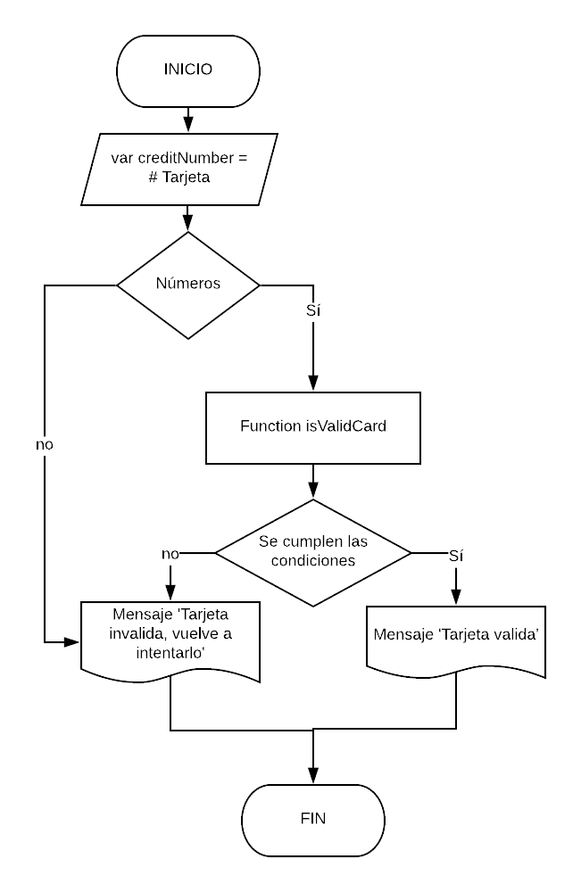

# TARJETA DE CRÉDITO VÁLIDA

### Descripción:
Se crea una web que pida un número de una tarjeta de crédito y confirme si es válida o no según el “algoritmo de Luhn”, se deben de cumplir las siguiente condiciones: el usuario no podrá ingresar un campo vacío, después de escribir el número de tarjeta devolverá si la tarjeta es valida o invalida.  

## Pseudocódigo
### Descripción

1. Se tiene una variable llamada cardNumbers que por medio de un prompt pide ingresar el número de tarjeta.

2. Se verifica que se estén trabajando con números de lo contrario aparecerá el mensaje ‘Tarjeta invalida, vuelve a intentarlo’.

2. Si las condiciones se cumplen y se escriben números para la tarjeta, se desarrolla la función isValidCard para verificar si cumple con las condiciones del algoritmo de Luhn.

3.  Si cumple con las condiciones se muestra un mensaje con la frase ‘Tarjeta válida’ de lo contrario aparecerá un mensaje con ‘Tarjeta invalida, vuelve a intentarlo’.

## Diagrama de flujo

